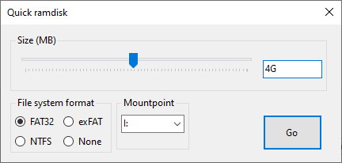

# imdisk-simple-gui
A very simple GUI to quickly create a ramdisk using ImDisk, for when you cannot use its GUI and don't want the command line.

### Requirements
To build: .NET 5.0 and VS 2019
To use: [ImDisk](https://sourceforge.net/projects/imdisk-toolkit/)
